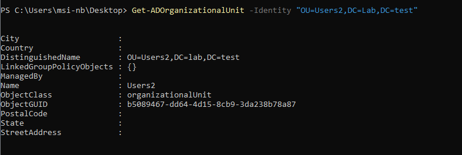
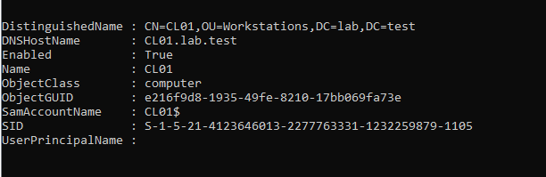
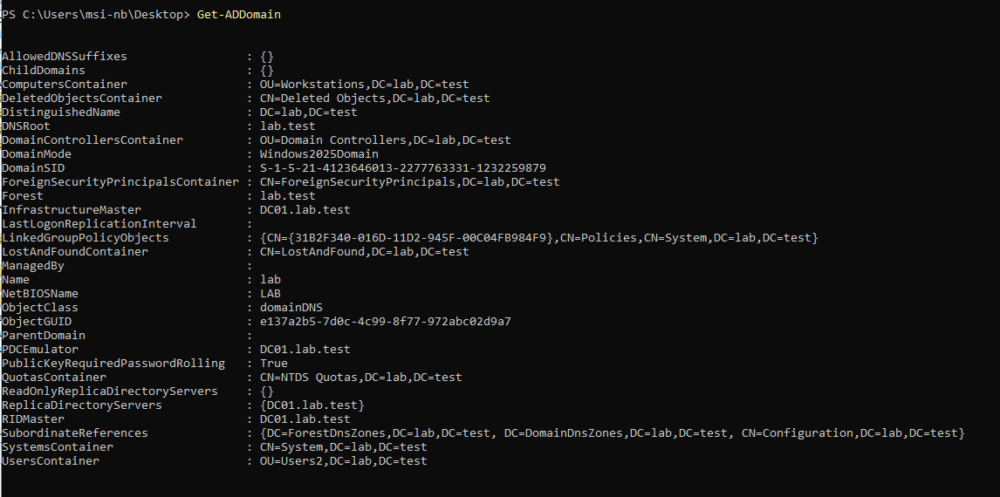
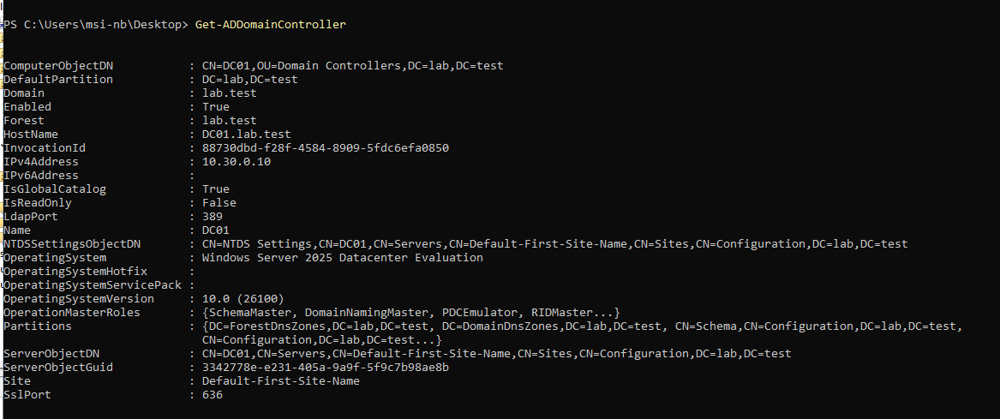
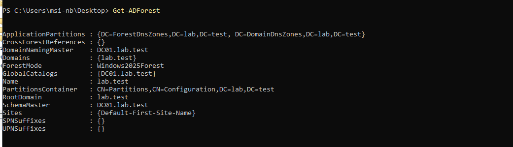
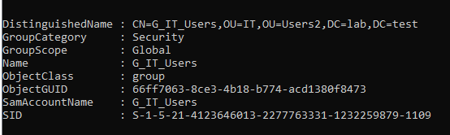
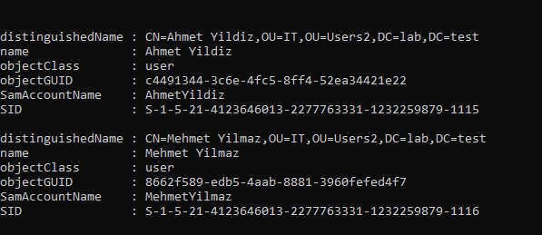
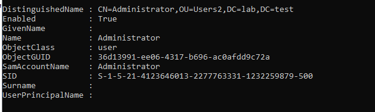

Active Directory'de oluşturulmuş OU'ları listelemek için kullanılır. Resimdeki örnekte users 2 Ou'sunun classı gibi bilgiler listelenmiş ve eğer olsaydı GPO'ları city, country, state, postal code gibi bilgiler listelenmiş olacaktı.

Domain'e dahil edilmiş olan bilgisayar hesaplarını sorgulamak ve listelemek için kullanılır. İşletim sistemi versiyonu veya hangi OU içinde oldukları gibi filtreler uygulanabilir.

Üzerinde çalışılan veya hedef alınan domainin genel yapılandırma ayarlarını, FSMO rollerini ve SID bilgilerini getirmek için kullanılır.

 Ortamdaki Domain controllerlarını listelemek veya belirli bir DC'nin IP adresi, site bilgisi, taşıdığı FSMO rolleri gibi kritik durum detaylarını öğrenmek için kullanılır.

forest yapılarında, forestın genel kök bilgilerini, , şema yöneticilerini ve fonksiyonel seviyesini sorgulamak için kullanılır

AD içerisindeki Security Group, Distribution Group listelemek veya belirli bir grubun detaylarına ulaşmak için kullanılır.

Belirli bir grubun içerisinde hangi kullanıcıların, bilgisayarların veya alt grupların üye olduğunu listelemek için kullanılır. Resimdeki örnekte IT grubundaki kullanıcıların listelenmiş halini görüyoruz.

AD üzerindeki kullanıcı hesaplarını aramak, listelemek veya belirli bir kullanıcının detaylı özelliklerini çekmek için kullanılır. Bu örnekte kullanıcılara daha detaylı gbilgiler (adres vs.) eklemediğimiz için namele kısıtlı kalmış diyebiliriz.