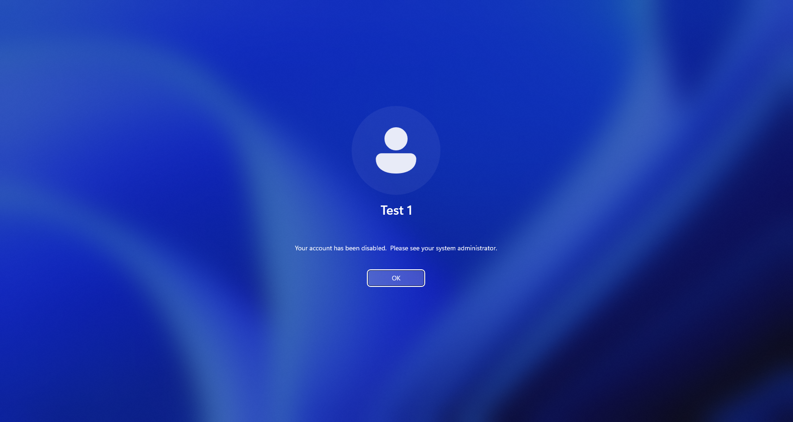
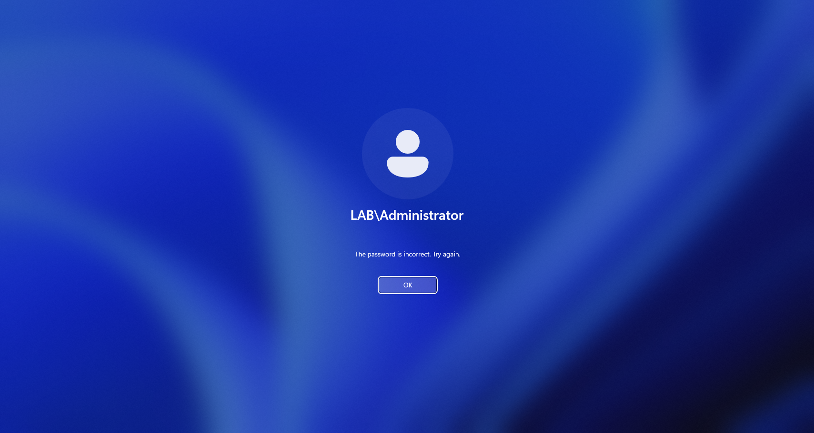
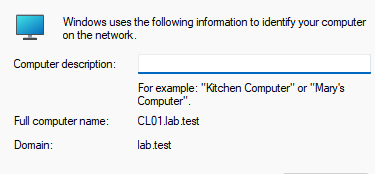
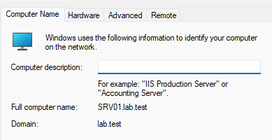
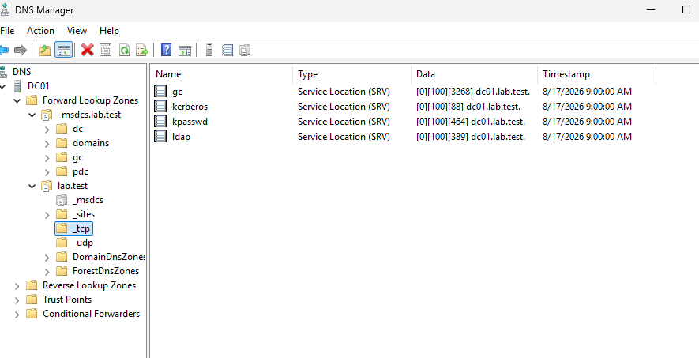

Test1 Kullanıcısı GPO denemesinden sonra disable edilmiş ve resimde görüldüğü gibi şu anda hesaba giriş yapılamıyor. Aynı şekilde kendisi bir domain kullanıcısı olduğu için resimdede görüldüğü gibi hesap aktif olduğu halde domain kullanıcıları cl01 üzerinden giriş yapabilmektedir.

 

Görüldüğü üzere admin hesabı üzerinden yapılan denemede yanlış şifreyle oturum açılamıyor

 

Üstteki iki resimlere bakılacak olursa CL01 ve SRV01 Domaine dahil durumda.

 

Domain Altında Kerberos ve LDAP servislerine ait SRV kayıtları oluşmuş durumda.