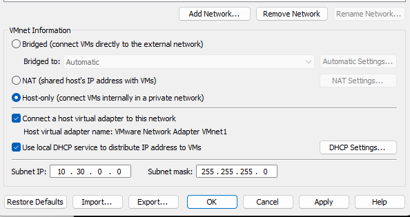
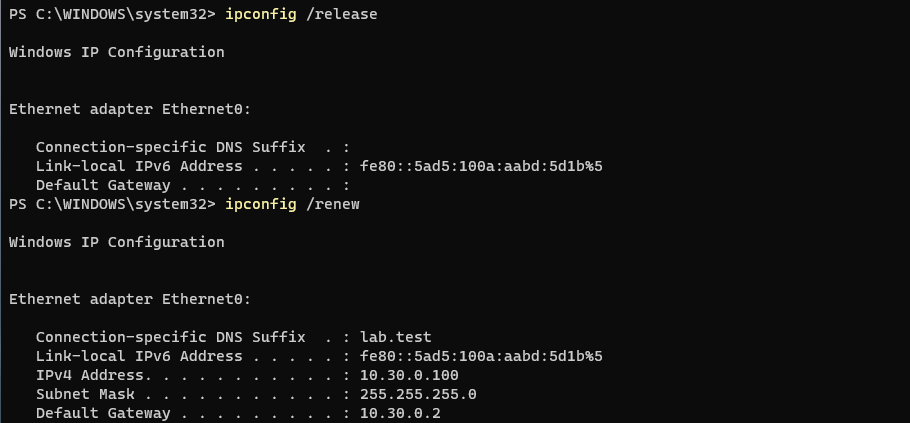
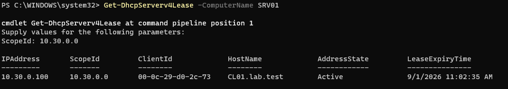
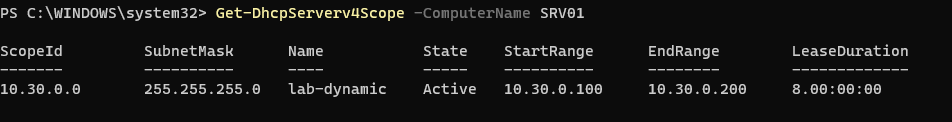
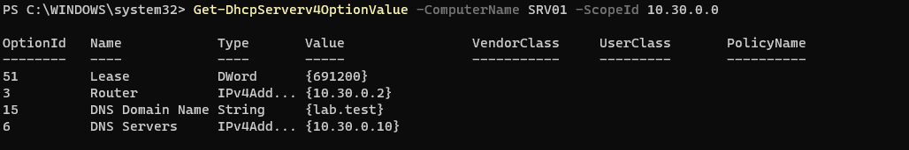

Resimde seçenekler arasunda en altta görülen Use local DHCP service to distribute IP address to VMs seçeneğindeki tiki kaldırarak Visual Studionun kendi DHCP servisleri devre dışı bırakıldı.

 

SRV01 üzerine DHCP serveri kurulduktan sonra CL01'in yeni IP adresi IP aralığını 100-200 arasında bıraktığım için 10.30.0.100 şeklinde oldu.

 

DHCP tarafından dağıtılmış IP lease/kiralama bilgilerini gösterir.

DHCP Server üzerindeki IPv4 scope'larını listeler. Scope, DHCP'nin IP dağıtacağı ağ aralığını tanımlar. Benim örneğimde durum yukarıda belirttiğim gibi aralığı 100-200 şeklinde bıraktığım için start 100 end 200 görünüyor.

DHCP Server veya belirli bir scope için tanımlanmış DHCP option değerlerini gösterir. Görüldüğü üzere benim durumumda laboratuvar Domainimin adı, DNS server adresim gibi verileri listelemiştir

Active Directory domain ortamında authorize edilmiş DHCP Server'ları listeler. Bu örnekte benim DHCP serverim SRV01 üzerinde olduğu için onun IP adresi ve Domaindeki adını vermiştir.

