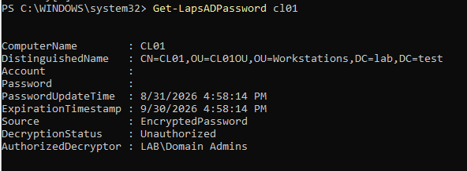
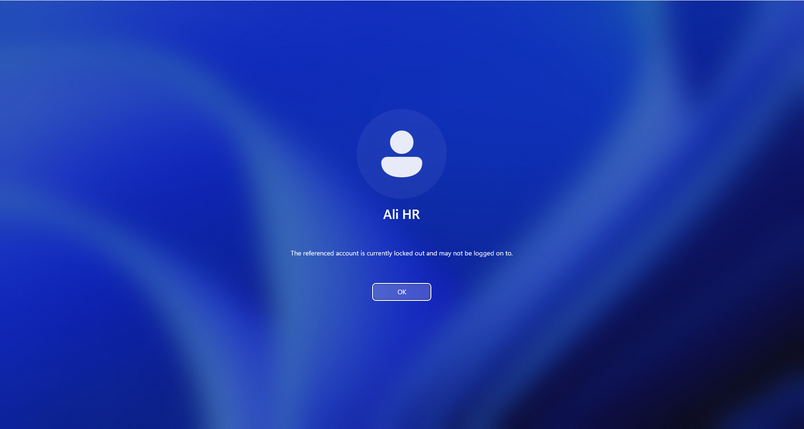
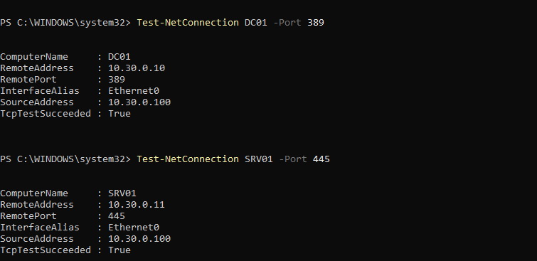
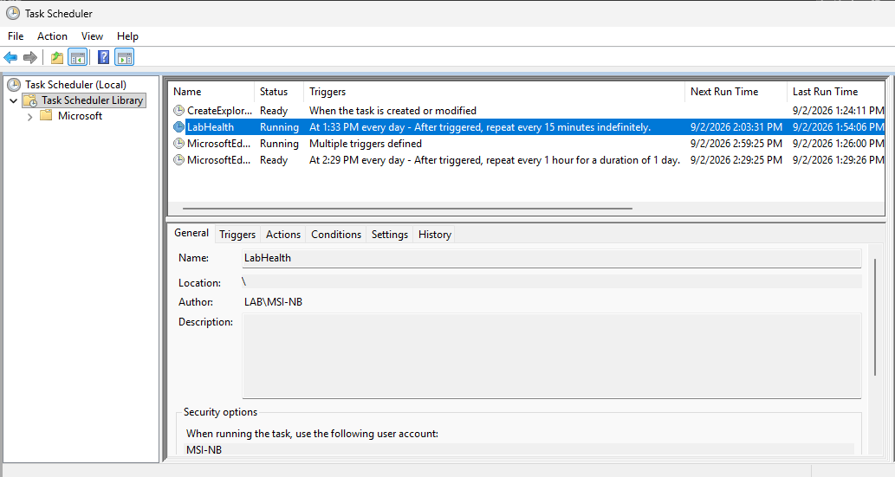

## Windows Laps

Gerekli AD şeması hazırlanarak CL01 üzerinde Windows LAPS policy'leri oluşturuldu ve yapılandırıldı. Belirtilen testler uygulandığında built-in admin hesabına başarıyla belirlenen kurallara uygun bir parola oluşturulup atandı. Yetkisiz kullanıcıların parolayı decrypt edemediği, Domain Admin hesabının ise başarıyla şifreyi görüntüleyebildiği doğrulandı. Manuel Rotation testi de aynı şekilde başarıyla sonuçlandı ve yeni parolalar AD ortamında saklandı. Örnekte yetkisiz bir kullanıcı ile şifre decrypt edilmeye çalışılmış ve görüldüğü üzere bilgiler Powershell ekranına yazılmamıştır.

## Domain password ve account lockout policy

Domain üzerinden merkezi olarak password policy ve account lockout policy yapılandırıldı. Test kullanıcısı üzerindeki denemede belirlenen maksimum hatalı deneme sayısı olan 3 hatalı denemeden sonra hesap belirlenen süre boyunda erişime engellendiği doğrulandı. Maximum passowrd length gibi şifre karmaşıklığını etkileyen kurallara şu anda kurallar yeterli gördündüğü için dokunmadım ancak account lockout duration politikasını hızlıca doğru çalışıp çalışmadığını kontrol etmek için bir dakikaya düşütrdüm ve maksimum hatalı deneme sayısını gene kolaylık açısından 3 yaptım. 

## Firewall hardening

GPO ile domain için merkezi bir firewall politikası oluşturuldu. Domain profili üzerinde varsayılan inbound connections bloklanırken outbound connectionsa izin verildi. Kullanılan hizmetlerin ve makineler arası mevcut iletişimin aksamaması için istisnalar tanımlandı. Yuıkardaki resimde portlar yapılan iletişim testlerinden ikisini görebilirsiniz.

## SMB/File Server hardening
SMB1 daha önce sistemde halihazırda disabled durumda olduğu için ekstra bir disable işlemine gerek olmadı.

SMB signing'in etkin olmadığı ve require security signature altında false mesajı görülmüş SMB hardening kapsamında iyileştirme gereken bir alan olduğu için ilerleyen aşamalarda aktifleştirilmek üzere not alındı.

## Privileged Accounts
Mevcut lab ortamında yönetim kolaylığı açısından tek bir yönetici hesabı kullanılmaktadır. Bu hesap, Domain Admins ve Enterprise Admins gibi yönetim rollerinin hepsine sahiptir.
Bunun yanında CL01 ve SRV01 makinelerininde kendi içlerinde built-in admin hesapları bulunmakta ve bu hesapların parolaları LAPS ile yönetilmektedir.
DC01 üzerinde oluşan ilk hesap sistemin varsayılanı olarak builtin-administrators grubuna dahil edilmiştir. Lab ortamında yönetim işlemlerini kolaylaştırmak için bu yapılandırma korunmuştur.

## Security health-check script eklemeleri ve Scheduled health monitoring 

Health Check scriptine Firewall, Laps ve diğer güvenlik kontrolleri için gerekli eklemeler yapıldı. Event Scheduler kullanılarak scriptin her 15 dakikada bir en üst yetki ile çalışması için zamanlanmış görev oluşturuldu. Oluşan raporların merkezi olarak saklanması için SRV01 üzerinde paylaşılan Shares klasörüne kaydedilecek şekilde düzenleme yapıldı.

| Kontrol | Önce | Sonra |
| --- | --- | --- |
| LAPS | aktif değil | aktif |
| SMB1 | aktif değil | aktif değil |
|Account Lockout | aktif değil | aktif
|HealthCheck Schedule | Manuel | otomatik