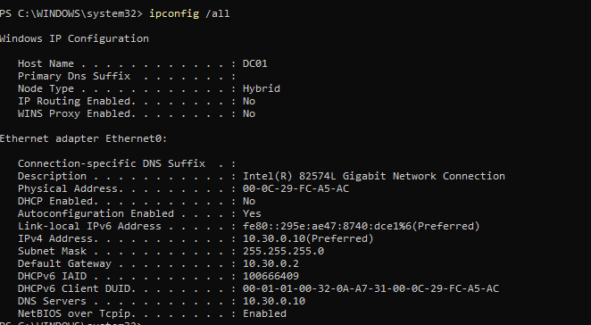
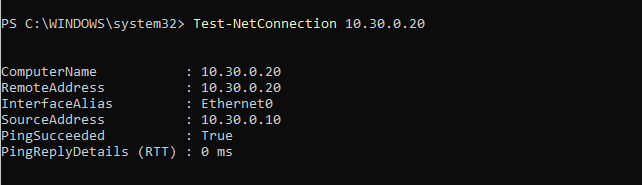
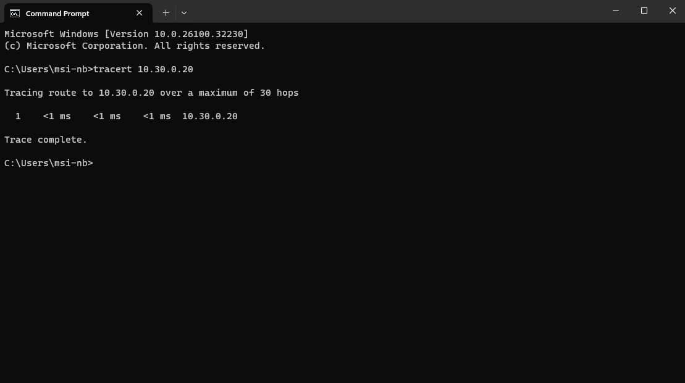
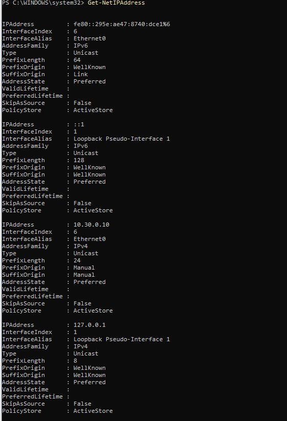

## IPconfig
herhangi bir ağa bağlı cihazın mac adresi ve o ağ içindeki ip adresi subnet maski gibi bilgilerini kontrol etmek için kullanılır

bu örnekte ben kendi atadığım ipv4 adresini ve oluşturduğum subneti kontrol etmek için kullandım 

resimdede görüldüğü gibi ipv4 adresi başarıyla atanmış ve default gateway oluşturduğum subnete uyuyor

## Ping

bilgisayarın internete veya ağ içindeki cihazlarla bağlantı kurup kuramadığını kontrol etmek için kullanılır 

resimde görüldüğü üzere makinemiz 10.30.0.20 ve 10.30.0.11 ip adresine dörder adet paket göndermiş ve %100 oranında cevap almıştır yani makineler aralarında sorunsuz iletişim kurabiliyor ve iletişim sırasında paket kaybı durumu yok

## Test-NetConnection

ağ bağlantısının durumunu hedef cihaza ulaşşıp ulaşamadığını ve belirtilen portların açık olup olmadığını belirtien bir tablo verir 

DC01 Makinesi ile CL01 makinesinin arasındaki bağlantı test edilmiştir

çıktıda görüleceği üzere hedef cihazın adı ip adresi ve cihaz adı görünüyor ancak ben bu noktada cihaz adı yerine ip adresiyle arattığım için name kısmındada adres yazıyor 

daha aşağıya bakacak olursak pingsucceded yani paketimiz hedefe ulaşmış arada bağlantı olduğunu gösteriyor aynı hostta oldukları içinde ms 0 yani paket anında diğer cihaza ulaşabilmiş

## Tracert

cihazın belirlenen hedefe ulaşmak için ne kadar hop ve ne kadar sürede bu noktaları geçtiğini kontrol etmek için kullanılır

bu örnekte DC01 makinesinin CL01 makinesine giderken nerelere uğradığını ve her noktada ne kadar zaman harcadığını kontrol etmiş oldum

eğer hedefe ulaşmak için birden fazla yönlendiriciden geçseydi örnektekinin aksine birden fazla satır olacaktı
<1ms gecikme süresi anında yanıt alındığını ve ağ bağlantısının sorunsuz olduğunu gösterir

sonuç ms değerlernin bir milisaniyenin bile altında olması sebebiyle beklediğimden iyi geldi

## Get-NetRoute
Bilgisayarın Routeing Tableını gösterir. Yani paket yerel ağdan dışarı çıkmak istediğinde kullandığı rotayı gösterir. Resim üzerinden inceleyecek olursak.

127.0.0.1 ve 255.255.255.255 gibi rotalar OS'in otomatik oluşturduğu standart dahili rotaları gösterir.

Daha altlara bakınca 0.0.0.0/0 ve next hoop 10.30.0.2 satırını görürüz bu satır yerel ağ dışındaki tüm adresler için paketlerin 10.30.0.2 ip adresini NAT/Gateway cihazına gönderileceğini söyler

10.30.0.0/24 nexthoop: 0.0.0.0 satırı ise bize 10.30.0.x ip adresi kuullanan yerel ağ cihazlarının hepsi aynı ağ kartı üzerinde olduklarından doğrudan arada herhangi bir router olmadan haberleşebildiğini gösterir

## Get-NetIPAdress

bilgisayardaki tüm ip adreslerini (ipv4 ve ipv6) ve hangi ağ kartına bağlı olduğunu gösterir 

bizim çıktımızda
10.30.0.10 ipv4 adresine bakacak olursak
interfacealias:ethernet0 satırında bu ipnin ana ethernet kartına tanımlı olduğunu görürüz

prefixlength:24 ifadesi subnet mask'in 255.255.255.0 olduğunu belirtir

prefixorigin/ suffixorigin:manual olma sebebiyse ip adresinin otomatik değil manuel şekilde belirtmemiz

127.0.0.1 loopback ise bilgisayarın kendi iç haberleşmesinde kullandığı yerel adresidir

diğer ipv6 satırları ise şu anda lab ortamında kullanmayacağım için fazla göz gezdirmedim