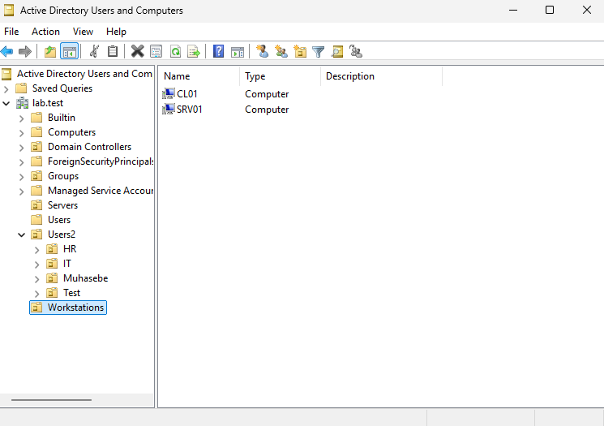
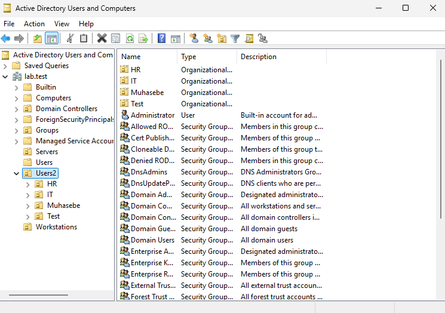
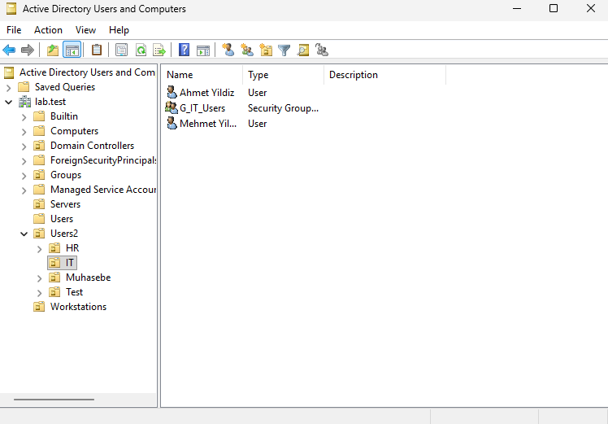

Kurumsal bir AD ortamında nesnelerin düz bir yapıda tutulması güvenlik, yönetim ve GPO atamaları açısından sorun yaratır. Bu nedenle gerçekçi bir ortama benzemesi için lab ortamında nesneleri gruplamak için lab.test dizini altında hiyerarşik bir OU yapısı oluşturuldu.

