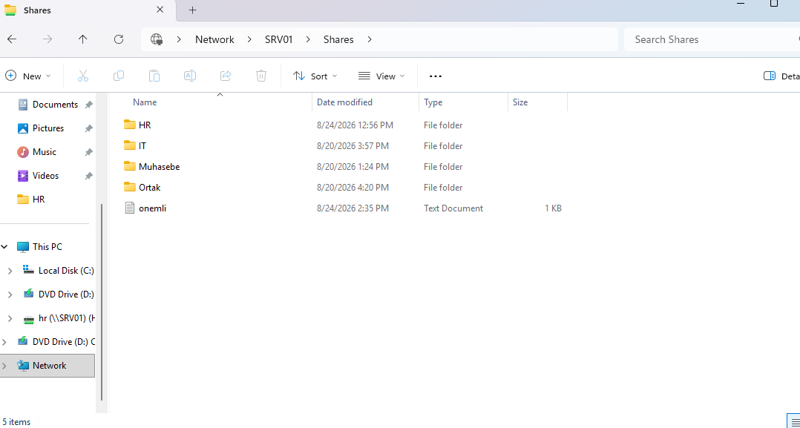
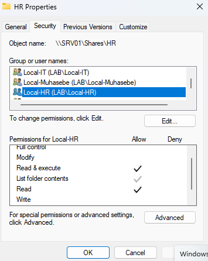
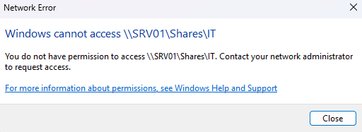
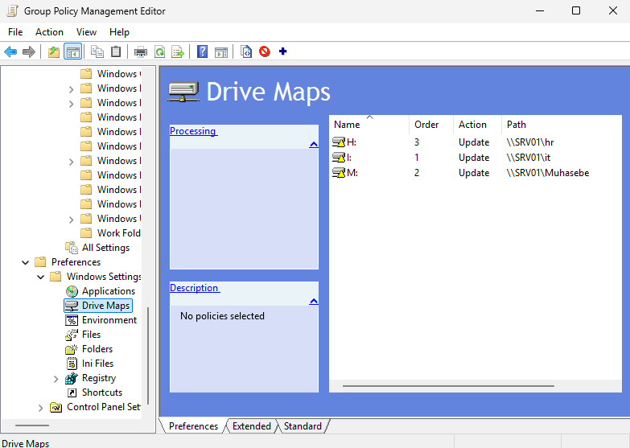
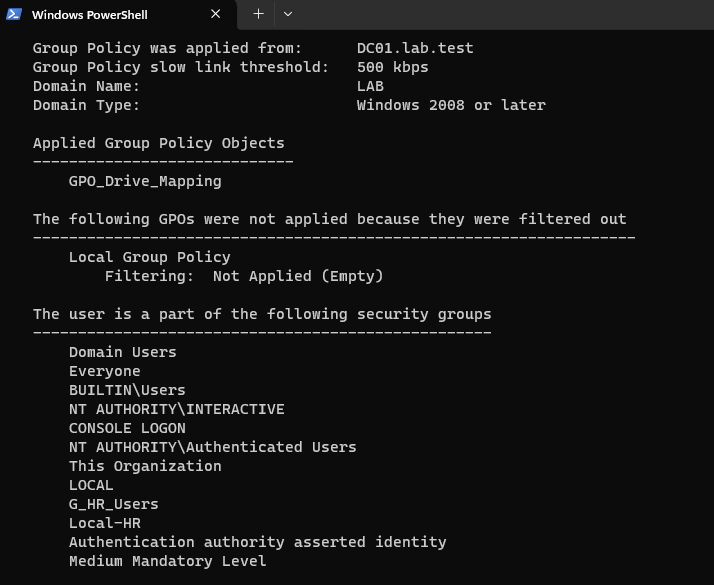
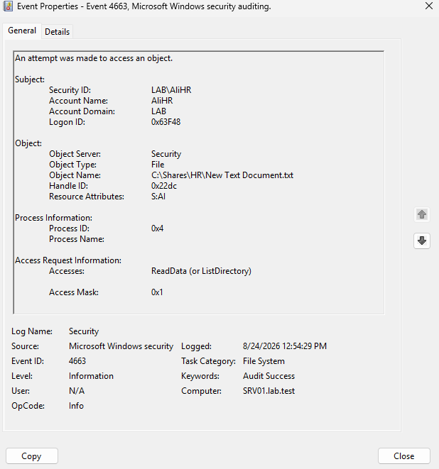
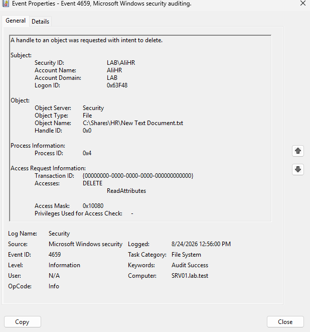
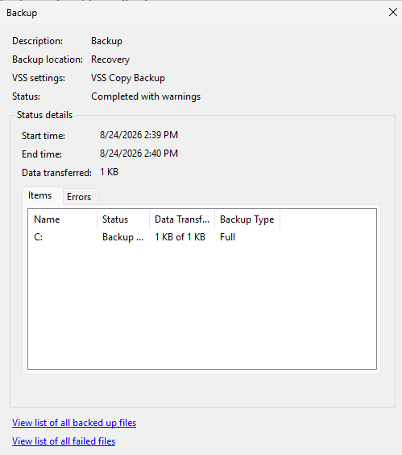
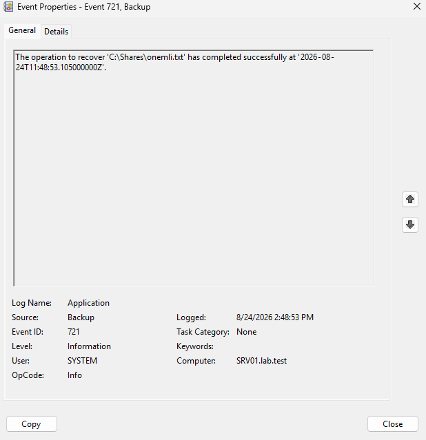

## Shared Folder & NTFS

belirtilen şekilde shares dosyası oluşturuldu ve AGDLP mantığıyla klasör yetkilendirmeleri yapıldı örnek HR kullanıcıları için AGDLP yapısı

|İsim|Türü| üyelik/yetki|
|---|---|---|
|Ali HR|User|G_HR_Users|
|Mehmet HR|User|G_HR_Users|
|G_HR_Users|Global Security Group|Local-HR|
|Local-HR|Local Security Group|NTFS Yetkilendirmeleri|

 

Yetkilendirme işlemlerinden sonra HR grubuna ait kullanıcılar görüldüğü üzere IT klasörüne erişim sağlayamıyor

Ortak klasörü için her departmana özel yönetici grupları oluşturuldu ve bu gruplara full control yetkisi verilirken diğer gruplara sadece lis ve read yetkisi verildi.

## Drive Mapping

GPO editör üzerinden görüleceği gibi SRV01 üzerinden IT HR ve Muhasebe birimlerinin herbiri için bir harf atanmıştır ve aşağıda görüleceği üzere policy şu anda aktif durumdadır.

## File Audit Logs

## Backup & Restore

Yukarıda  önemli.txt dosyasının Wİndows Server Backup backup alımı ve Event Viewer üzerinden silinme logları görülmekte.

Bu noktada ise File recovery ekranı ve event viewer ile dosyanın geri getirilme ekranları görülmekte.