### Gerçek Production Ortamlarında Neden Çok Katmanlı CA Mimarisi Kuullanılır
Production ortamlarında Offline Root CA → Issuing CA mimarisinin temel amacı Root CA'nın güvenlik açısından en değerli bileşen olarak izole edilmesi ve günlük sertifika işlemlerinin daha az kritik olan Issuing CA üzerinden yürütülmesidir.

### Lab CS Ayarları

CA Type: Lab AD domain ortamında olduğu için Enterprise CA Tercih edildi.
Common Name: lab-root-ca
Cryptographic Provider: Windwosun CNG altyapısını kullanması sebebiyle Microsoft Software Ket Storage Provider tercih edildi.
Key Length: RSA 2048 Bit
Hash Algorithm: Yaygın olması sebebiyle SHA-256 tercih edildi
CA Certificate Validity: Sertifikaların uzun ömürlü olması için CA Certificate

### Domain Trust

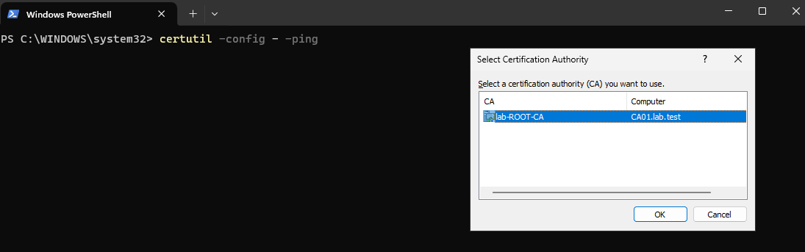

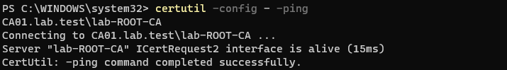

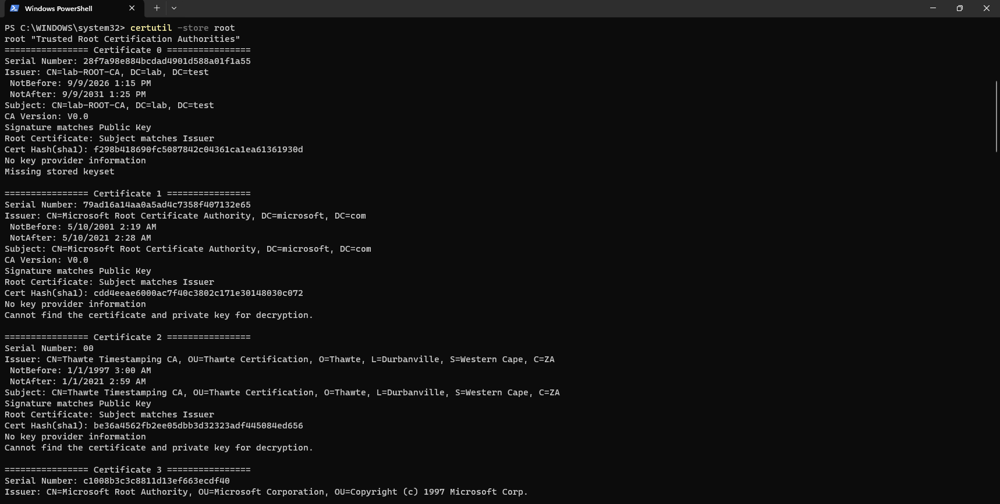

### Certificate Template
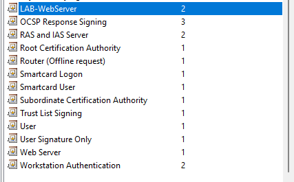
Mailde belirtildiği gibi, built-in Web Server template'i doğrudan değiştirmek yerine duplicate edilerek `Lab-WebServer` adıyla yeni bir template oluşturuldu.

### Computer Certificate Auto-Enrollment GPO

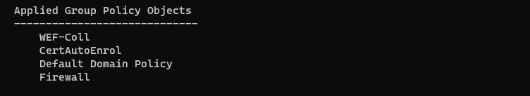

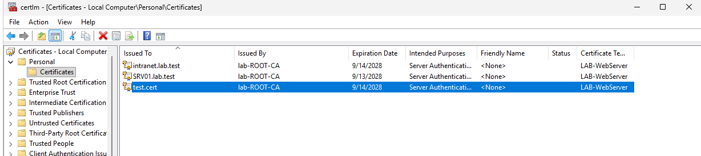

Belirtildiği şekilde GPO üzerinden SRV01 makinesinin otomatik olarak sertifika alması sağlandı. 2. resimde görüleceği üzere, test ve denemeler sırasında SRV01 üzerinde 3 adet sertifika oluştuğu görülmektedir.

### IIS Kurulumu
Mailde belirtilen şekilde bir IIS kurulumu yapıldı ve DNS üzerinde A kaydı oluşturulup SRV01'e yönlendirildi

Windows Admin Lab
Server: SRV01
Domain: lab.test
HTTPS: Enabled

DAha sonra LAB-WebServer template’ini kullanarak uygun bir certificate alındı IIS üzerinde HTTPS Port 443 binding oluşturuldu CL01 Makinesi üzerinden https://intranet.lab.test adresine erişim doğrulandı.

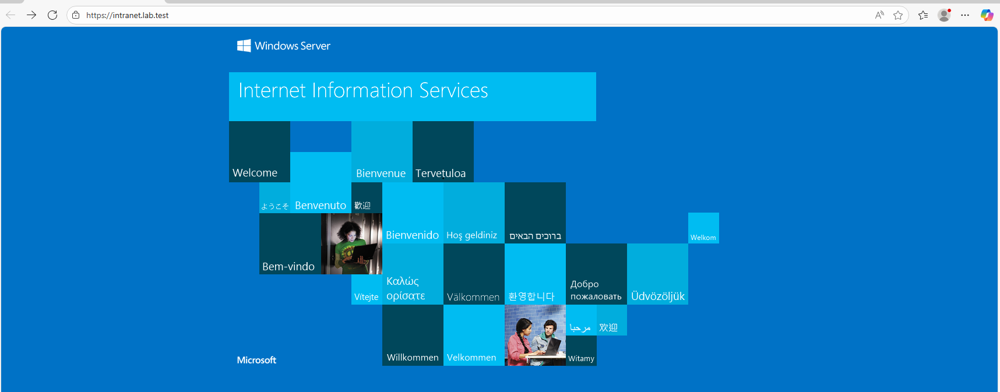

### HTTP HTTPS Yönlendirmesi

IIS Mannager üzerinden https yönlendirmesi ile intranet adresini arattığımızda artık direkt https olarak geliyor

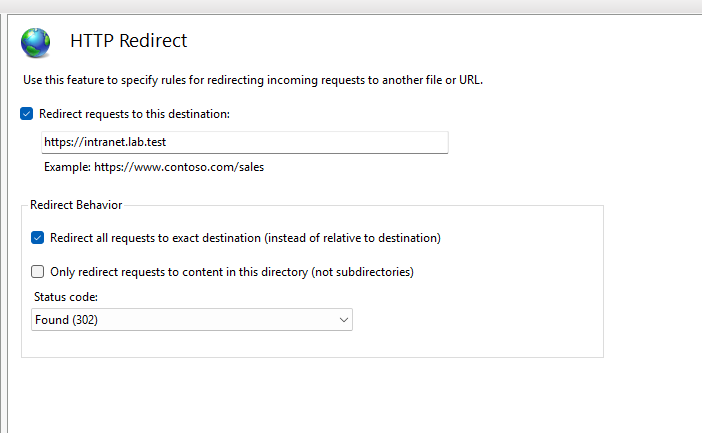

### HTTP Renewal

Issue: Cihaz kullanıcı veya servis sertifika talep eder bu aşamada CA talebi değerlendirir, sertifika template'ini uygular, SAN bilgilerini belirler, sertifikayı imzalayıp cihaza verir.

Use: Sertifika verildikten sonra işlevini yerine getirmeye başlar.
Tarayıcı: Sertifikayı alır, geçerlilik tarihini kontrol eder, CA tarafından imzalanıp imzalanmadığına bakar, gerekirse revocation durumunu kontrol eder eğer bir sotun yoksa HTTPS bağlantısı kurulur.

Renew: Sertifikanın süresi dolmaya yaklaşırken aynı kullanım amacı için yeni bir sertifika alınması.

Replace: Burda sertifika yapılandırmasının değiştirilmesi söz konusudur. Bu durumda yeni bir sertifika alınır ve eskisinin yerine geçirilir.

Expire: Sertifikanın NotAfter Tarihine ulaşmasıdır.

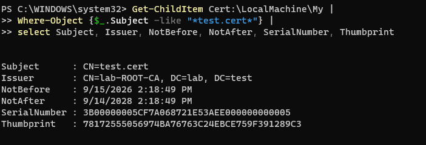

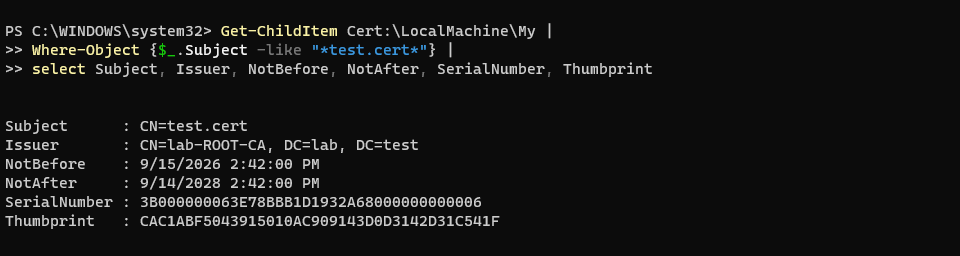

Bu örnekte test aynı gün ve saat içerisinde gerçekleştirildiği için NotBefore ve NotAfter tarihlerinde büyük bir fark görülmemektedir. Ancak ilk resim ve ikinci resim incelendiğinde sertifikaların NotAfter tarihleri arasında 24 dakikalık bir fark olduğu görülmektedir. Buna göre renewal işlemi sonrasında oluşturulan yeni sertifika, önceki sertifikaya göre 24 dakika daha uzun süre geçerli olmaktadır. Ek olarak sertifikalar incelendiğinde Thumbprint ve Serial Number değerlerinin de değiştiği görülmektedir.

### Yanlış Certificate Senaryoları

#### Hostname Mismatch
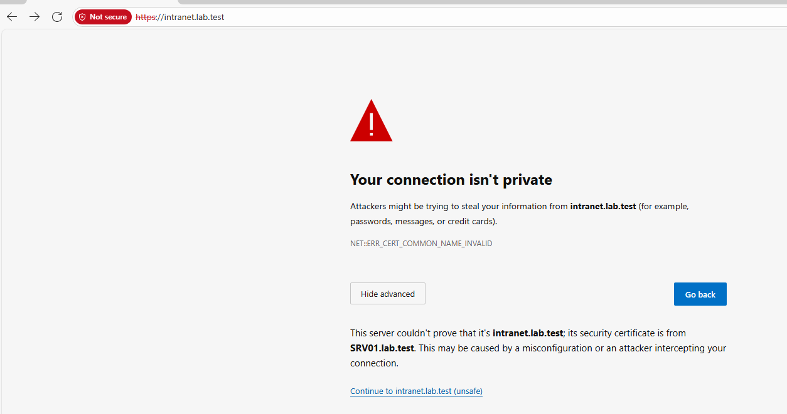
Bu testte kullanılan sertifikanın hostname bilgisi ile erişilen hostname eşleşmemektedir. Görüldüğü üzere tarayıcı intranet.lab.test adresine erişmeye çalışırken sertifika SRV01.lab.test hostname'i için düzenlendiği için Name Mismatch uyarısı vermektedir. Bu nedenle sertifika güvenilir bir CA tarafından verilmiş olsa da hostname eşleşmediği için bağlantının güvenli olmadığı belirtilmektedir.

#### Untrusted Certificate
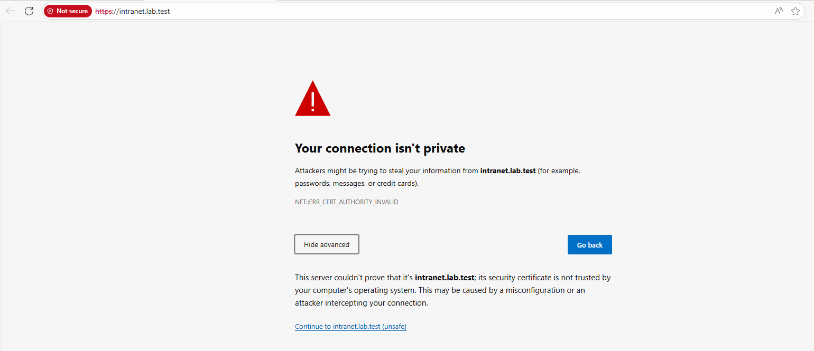
Bu testte ise kullanılan certificate trust chain içerisinde yer almamaktadır. Tarayıcı sertifikanın bilgisayar tarafından güvenilir bir Certificate Authority tarafından verilmediğini tespit ettiği için Untrusted Certificate uyarısı vermekte ve sertifikaya güvenilemediğini belirtmektedir.

### CA Backup

17 Eylül tarihinde CA01 üzerinde bulunan CA veritabanının yedeği alınmıştır. Backup işlemi certutil aracı kullanılarak gerçekleştirilmiş ve CA database backup'ı için certutil -backupDB komutu kullanılmıştır. Backup dosyaları, CA01 üzerinde oluşturulan C:\CABackup klasörü içerisinde saklanmıştır. CA'nın olası bir sistem arızası veya veri kaybı durumunda restore işlemi, certutil -restoreDB komutu kullanılarak alınan database backup'ının geri yüklenmesi ve gerekli CA yapılandırmalarının yeniden uygulanması şeklinde gerçekleştirilebilir.