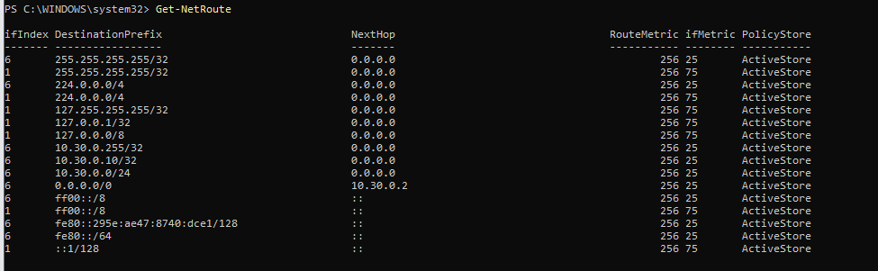

Bilgisayarın Routeing Tableını gösterir. Yani paket yerel ağdan dışarı çıkmak istediğinde kullandığı rotayı gösterir. Resim üzerinden inceleyecek olursak.

127.0.0.1 ve 255.255.255.255 gibi rotalar OS'in otomatik oluşturduğu standart dahili rotaları gösterir.

Daha altlara bakınca 0.0.0.0/0 ve next hoop 10.30.0.2 satırını görürüz bu satır yerel ağ dışındaki tüm adresler için paketlerin 10.30.0.2 ip adresini NAT/Gateway cihazına gönderileceğini söyler

10.30.0.0/24 nexthoop: 0.0.0.0 satırı ise bize 10.30.0.x ip adresi kuullanan yerel ağ cihazlarının hepsi aynı ağ kartı üzerinde olduklarından doğrudan arada herhangi bir router olmadan haberleşebildiğini gösterir