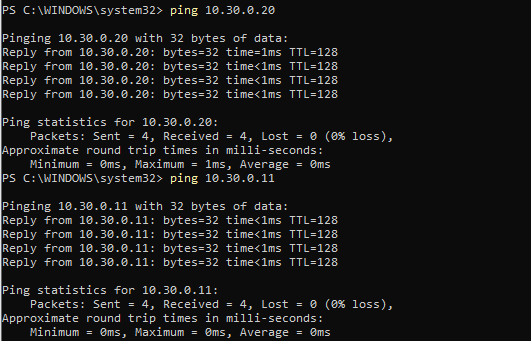

bilgisayarın internete veya ağ içindeki cihazlarla bağlantı kurup kuramadığını kontrol etmek için kullanılır 

resimde görüldüğü üzere makinemiz 10.30.0.20 ve 10.30.0.11 ip adresine dörder adet paket göndermiş ve %100 oranında cevap almıştır yani makineler aralarında sorunsuz iletişim kurabiliyor ve iletişim sırasında paket kaybı durumu yok