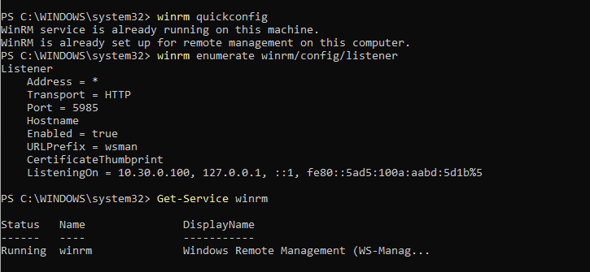
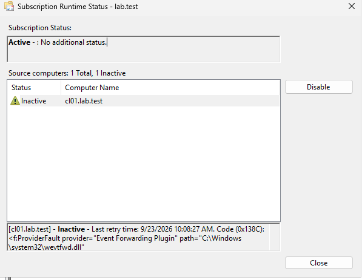

Source Initiated
Source:CL01
Collector:SRV01
Subscription Name: lab.test
Selected Events: By log>Security

## Collector Çıktıları

## Source Çıktıları

## Collector Inactive

Collector tarafında Selected Events bölümünde Security kategorisinin yanında veya Security ile birlikte Application, Setup ve System kategorilerinden biri seçildiğinde bu bölüm Active olarak görünüyor. Ancak yalnızca Security kategorisini seçip diğer kategorileri kaldırınca, subscription Inactive duruma geçiyor.